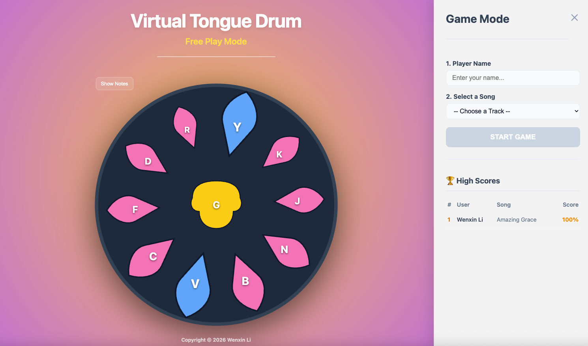

# Virtual Tongue Drum

### A Web-Based Instrument and Music Game


**Live Demo:** [Play the Game Here](https://virtual-tongue-drum.vercel.app/)

**Gameplay Demo:** [Watch the Demo](https://www.youtube.com/watch?v=GpOePHBJSrQ)


## About the Project

**Virtual Tongue Drum** is a web-based application that serves as both a digital instrument and a music game. It simulates the unique circular layout of a physical tongue drum, blending musical creativity with arcade-style mechanics. By challenging players to map visual cues to specific notes in real-time, the application gamifies the learning process, helping users master the instrument while having fun.



### How It Works
* **Free Play Mode:** Explore the instrument's scale using mouse or keyboard controls.
* **Game Mode:** Follow the visual cues to master real songs.
* **Compete:** Track your accuracy and climb the ranks on the global leaderboard.


### Key Features

* **Real-time Audio Synthesis:** Uses Tone.js and the Web Audio API for dynamic sound generation.
* **Interactive Challenges:** Learn songs and get instant feedback on your performance.
* **Global Leaderboard:** Compete for the top spot by minimizing mistakes and maximizing accuracy.


## Tech Stack

**Backend:**
* **Language:** Python 3
* **Framework:** Flask (REST API)
* **ORM:** SQLAlchemy
* **Database:** PostgreSQL

**Frontend:**
* **Framework:** React 19 (Vite)
* **Language:** TypeScript
* **Styling:** Component-scoped CSS files
* **Audio:** Web Audio API (Tone.js)

## API Overview (Flask & SQLAlchemy)
The backend serves game data (songs, note maps) and user persistence (scores, leaderboard).

| Method | Endpoint | Description |
| :--- | :--- | :--- |
| `GET` | `/api/songs` | Fetches all available songs and note maps. |
| `GET` | `/api/songs/<id>` | Fetches a single song by id. |
| `GET` | `/api/scores` | Retrieves global high scores. |
| `POST` | `/api/scores` | Saves a new game result and returns rank. |
| `GET` | `/seed_db` | Dev utility to rebuild and seed the database. |

## Database Schema
- **Users:** Unique player identities
- **Songs:** Metadata plus `notes` stored as JSON for fast retrieval
- **Scores:** Join table linking users and songs with `score`, `mistakes`, and `played_at`

## Local Development

### 1) Clone and install
```bash
git clone <your-repo-url>
cd virtual-tongue-drum
```

### 2) Server setup (Flask)
```bash
cd server
python -m venv venv
source venv/bin/activate
pip install -r requirements.txt
```

Create a .env file in the server folder with:
```
SQLALCHEMY_DATABASE_URI=postgresql+psycopg2://<user>:<password>@<host>:<port>/<db>
```

Note: The server requires this env var to start. For local development you can also use SQLite, e.g.:
```
SQLALCHEMY_DATABASE_URI=sqlite:///dev.db
```

Seed the database:
```bash
python seed.py
```

Run the server:
```bash
python run.py
```

### 3) Client setup (Vite + React)
```bash
cd client
npm install
npm run dev
```

Create a .env file in the client folder with:
```
VITE_API_URL=http://localhost:8080/api
```

## Tests

Backend tests:
```bash
cd server
source venv/bin/activate
pytest
```

## Project Structure
```
client/   # React + TypeScript frontend
server/   # Flask API + database models
```

## Deployment
- **Frontend:** Vercel
- **Backend:** Render
- **Database:** Neon


## Author

**Wenxin Li** ([LinkedIn](https://www.linkedin.com/in/wenxin-li-phd/))

